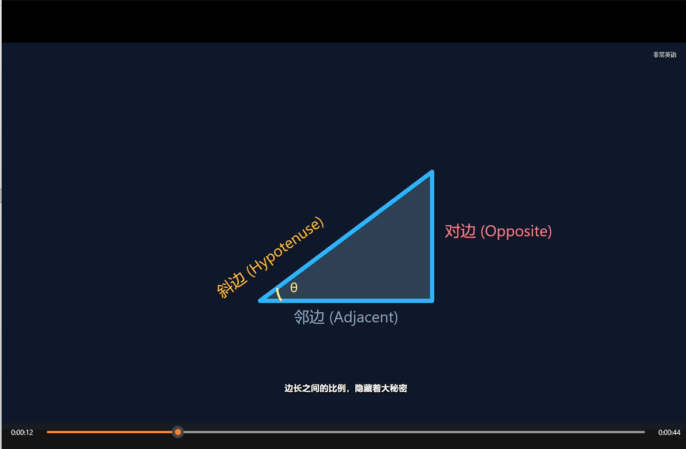
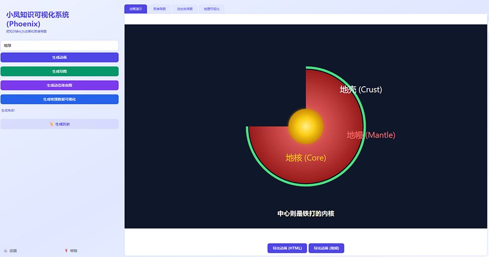
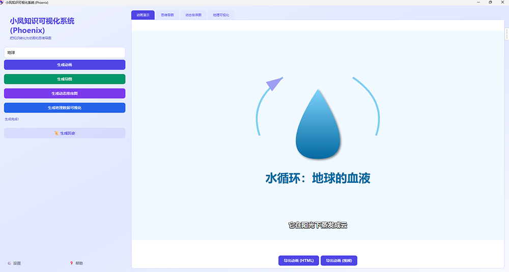
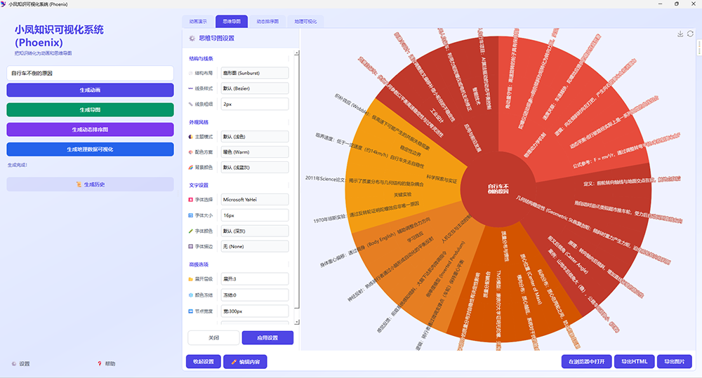
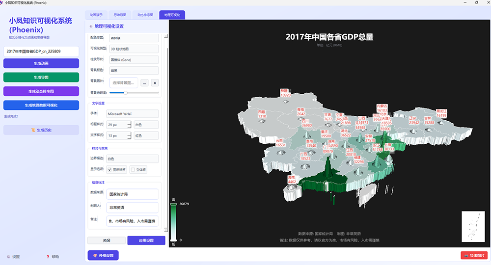
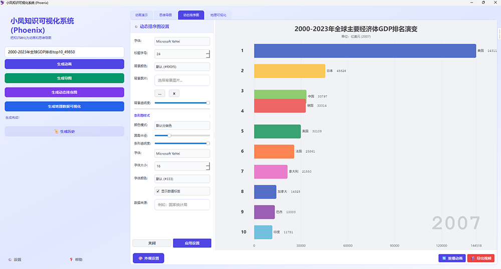

<div align="center">
  
  <h1>小凤知识可视化系统 (Phoenix)</h1>
  <p>
    <b>将知识转化为直观的视觉体验 / Transform Knowledge into Intuitive Visual Experiences</b>
  </p>
  <p>
    
    
    
    
  </p>
</div>

---

## 📖 简介 (Introduction)

**小凤知识可视化系统 (Phoenix)** 是一个功能强大的桌面 GUI 应用程序，专为知识创作者、教育工作者和数据分析师设计。它利用先进的大语言模型 (LLM) 技术，能够深入理解文本内容，并自动将其转化为丰富多样的可视化形式。

无论是复杂的概念关系、地理空间数据，还是动态的演变过程，Phoenix 都能帮您一键生成高质量的思维导图、交互式地图和生动的动画视频，让知识的传递更加高效、直观。

**Phoenix** is a powerful desktop GUI application designed for knowledge creators, educators, and data analysts. Leveraging advanced Large Language Model (LLM) technology, it deeply understands text content and automatically transforms it into various rich visualization forms.

---

## ✨ 功能特点 (Features)

*   🧠 **智能文本分析 (Intelligent Analysis)**
    *   集成 LLM 能力，自动提取文本中的关键实体、关系和地理信息。
    *   支持多语言处理，精准理解上下文。

*   🕸️ **思维导图生成 (Mind Mapping)**
    *   自动生成层级清晰、逻辑严密的思维导图。
    *   支持 ECharts 交互式展示，节点可缩放、拖拽。

*   🌏 **地理空间可视化 (Geo Visualization)**
    *   智能识别文本中的地名和位置信息。
    *   生成交互式地理地图，直观展示数据分布和地理关系。

*   🎬 **动态动画创作 (Animation Generation)**
    *   将静态知识转化为生动的解说视频和图表动画。
    *   支持 Bar Race (动态条形图) 等多种动画形式，展现数据随时间的变化。

*   🔒 **安全与隐私 (Security & Privacy)**
    *   支持本地化运行模式，关键数据可离线处理。
    *   敏感配置 (如 API Key) 独立存储，互不干扰。

---

## � 演示与截图 (Demo & Screenshots)

### 🎥 演示视频 (Demo Video)

[](assets/demovideo.mp4)

> 点击图片观看演示视频 / Click the image to watch the demo video

### 📸 截图预览 (Screenshots)

| | | |
|:---:|:---:|:---:|
|  |  |  |
|  |  |  |

---

## ⬇️ 下载 (Download)

您可以直接下载打包好的 Windows 可执行文件 (.exe)，无需安装 Python 环境即可运行。

*   **下载地址 (Download Link)**: [夸克网盘 (Quark Pan)](https://pan.quark.cn/s/2f74b490628e)

---

## �� 快速开始 (Quick Start)

### 🛠️ 环境要求 (Prerequisites)

*   **Operating System**: Windows 10/11
*   **Python**: 3.8 或更高版本
*   **Dependencies**: 见 `requirements.txt`

### 📥 安装步骤 (Installation)

1.  **克隆仓库 (Clone Repository)**
    ```bash
    git clone https://github.com/frank36512/phoenix.git
    cd phoenix
    ```

2.  **创建虚拟环境 (Create Virtual Environment)** (推荐/Recommended)
    ```bash
    python -m venv .venv
    # Windows:
    .venv\Scripts\activate
    ```

3.  **安装依赖 (Install Dependencies)**
    ```bash
    pip install -r requirements.txt
    ```

### ⚙️ 配置 (Configuration)

本项目需要配置 API 密钥以使用 LLM 功能。请复制示例配置文件并进行修改：

```bash
# Windows (PowerShell):
Copy-Item credentials.example.json credentials.json
```

打开 `credentials.json` 并填入您的 API Key：
```json
{
    "api_key": "sk-xxxxxxxxxxxxxxxxxxxxxxxxxxxxxxxx",
    "base_url": "https://api.openai.com/v1"
}
```

### ▶️ 运行 (Run)

启动应用程序：

```bash
python main.py
```

---

## 📦 构建与发布 (Build)

如果您希望将程序打包为独立的 Windows 可执行文件 (.exe)，可以使用内置的构建脚本：

```bash
python build.py
```

打包完成后，可执行文件将位于 `dist/` 目录下。

---

## 🤝 贡献 (Contributing)

欢迎提交 Issue 和 Pull Request！如果您有好的想法或建议，请随时与我们联系。

## 📄 许可证 (License)

本项目采用 **Apache 2.0** 许可证。详情请参阅 [LICENSE](LICENSE) 文件。

---
<div align="center">
  <p>Made with ❤️ by Phoenix Team</p>
</div>
